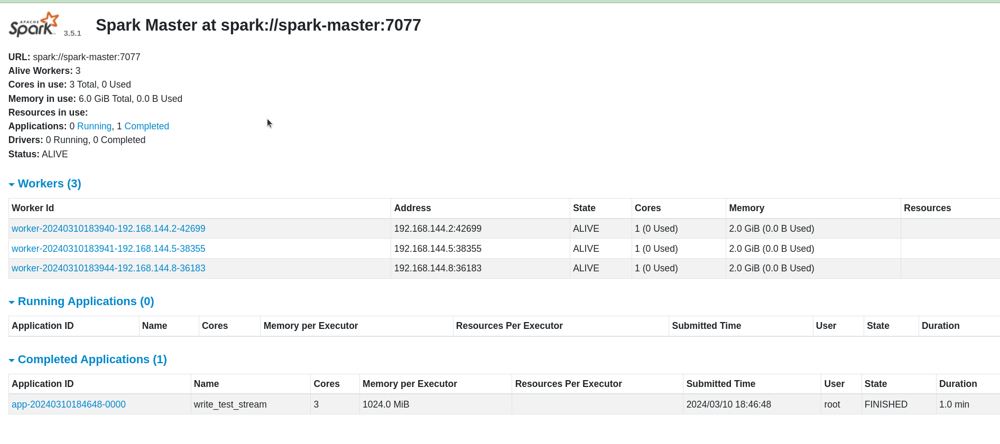
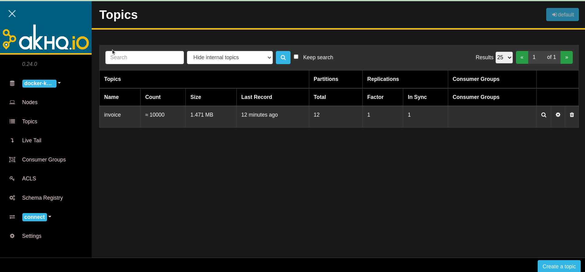
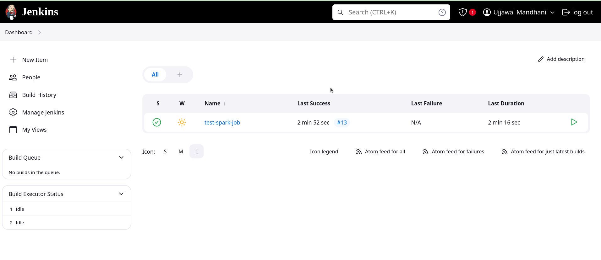

spark-submit --packages org.apache.spark:spark-sql-kafka-0-10_2.12:3.5.1 spark_job.py

spark-submit --packages org.apache.spark:spark-sql-kafka-0-10_2.12:3.5.1 --master spark://spark-master:7077 --conf spark.master=spark://spark-master:7077 --name MySparkJob --queue root.default --deploy-mode client spark_job.py

### URLS 

Jenkins url - http://0.0.0.0:10801/
akhq url - http://0.0.0.0:10018/ui/docker-kafka-server/topic
spark url - http://0.0.0.0:9010/

### Screenshots 

Spark 

Aqhq 

Jenkins

